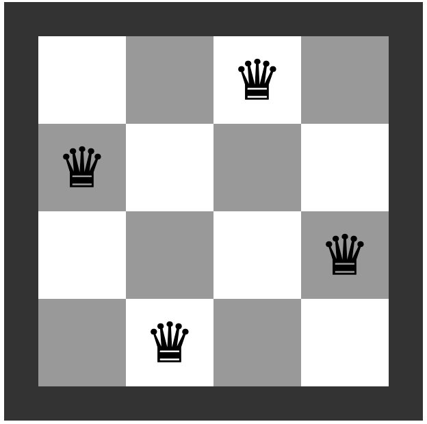

# CS7IS2 AI Group Project

## Team Members
Garvit Vijai  
Rohan Girotra  
Saubhagya Sharma  
Manu Prasannakumar  

## Problem Statement
We addressed N-Queen Constraint Satisfaction Problem(CSP) in our project. The N-Queen problem is about placing N queens on a NxN board such that no two queens threaten each other.



## Algorithms Implemented
1. Backtracking algorithm 
2. Hill climbing algorithm 
3. Genetic algorithm  

## Setup
```
git clone https://github.com/garvit1608/CS7IS2-AI-Group-Project.git
```

```
cd CS7IS2-AI-Group-Project
```

## Running Code

#### For running in browser (for UI version)

```
python3 ChessUI/chessboard.py
```

The application starts running at http://127.0.0.1:5000/


#### For running in terminal (CLI version)

```
python3 main.py
```

